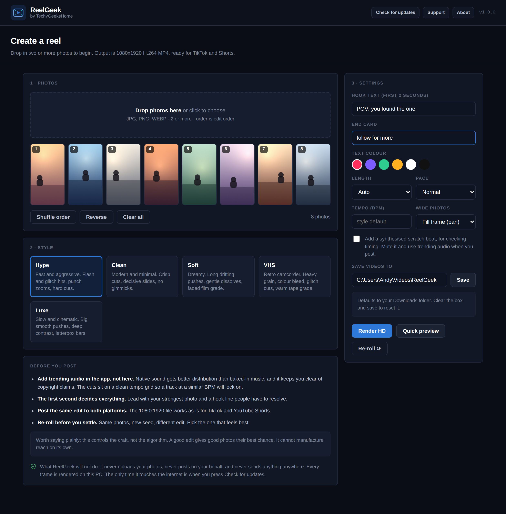
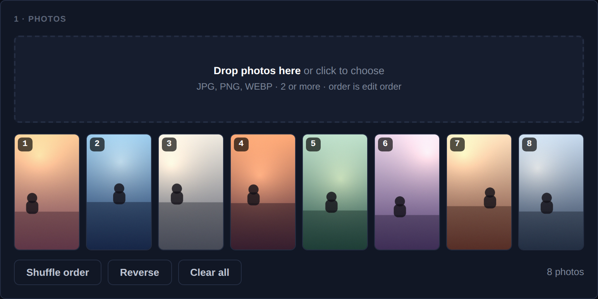
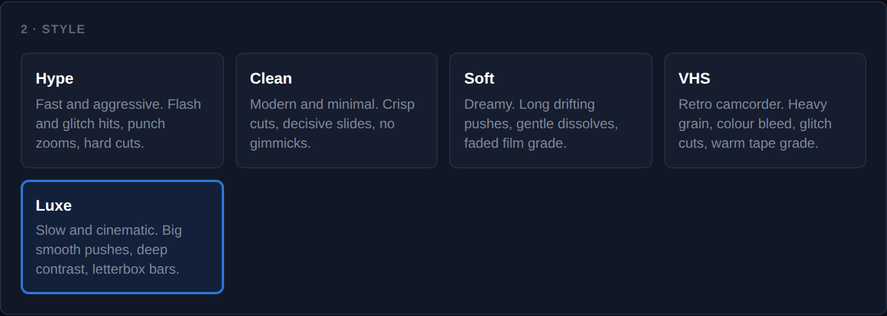
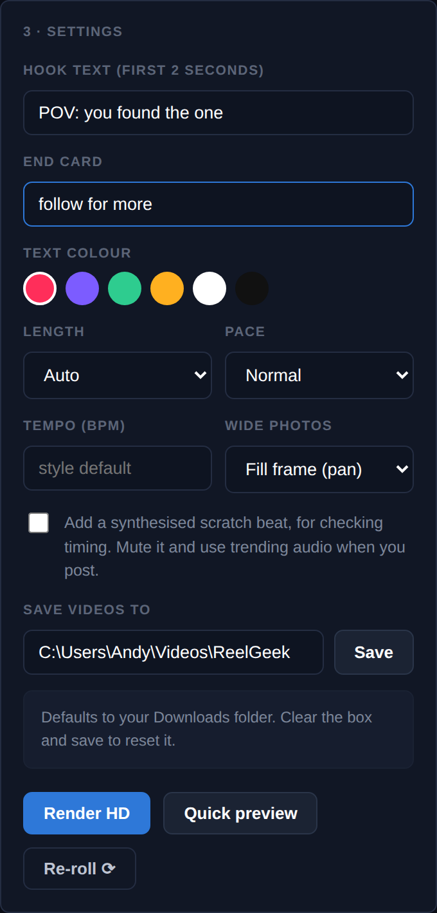
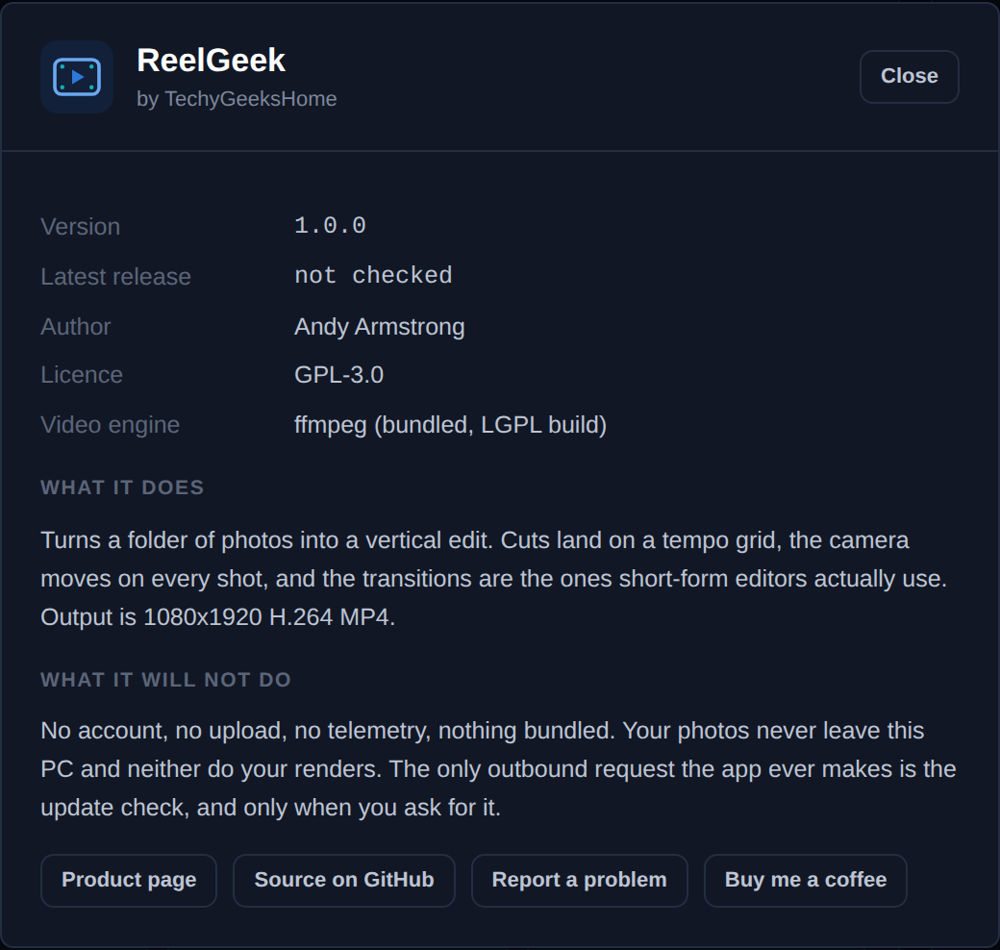

<div align="center">


# ReelGeek

**Turn a pile of photos into a vertical edit. Cuts on the beat, real camera moves, ready for TikTok and Shorts.**

[](https://github.com/techygeekshome/ReelGeek/actions/workflows/build-windows.yml)
[](https://github.com/techygeekshome/ReelGeek/releases)
[](#download--run)
[](LICENSE)
[](https://techygeekshome.info)
[](https://ko-fi.com/techygeekshome)

[Download](#download--run) · [Using it](#using-it) · [The styles](#the-styles) · [Command line](#command-line) · [How it works](#how-it-works)

</div>

---

## 🎬 See it in action

[](https://www.youtube.com/watch?v=aRIQr_0RMGg)

Photos in, a finished vertical edit out, in under a minute.

---

## What it refuses to do

* **No account.** There is nothing to sign up for and nothing to log in to.
* **No upload.** Your photos are read from your disk and rendered on your CPU. They are never sent anywhere, and neither are your finished videos.
* **No posting on your behalf.** ReelGeek makes the file. You post it.
* **No telemetry.** Nothing is counted, timed or reported back.
* **No watermark, no export limit, no paid tier.** The whole thing is free.
* **No bundled extras.** The installer contains the app and ffmpeg. Nothing else.

The only outbound request the app ever makes is the update check, and only when you press the button.

---

## What it does

Turns a folder of photos into a vertical **edit**, not a slideshow. Cuts land on a tempo grid, the camera moves on every shot, and the transitions are the ones short-form editors actually use: whip pans with real motion blur, snap zooms, flash frames, RGB-split glitches, hard cuts on the beat.

Output is **1080 x 1920 H.264 MP4**, which uploads as-is to TikTok and YouTube Shorts.

### Where 1.0 stops

* Photos in, video out. It does not edit existing video clips.
* No music is baked in. That is deliberate, and explained under [the settings that matter](#the-settings-that-matter).
* One reel at a time. There is no batch mode yet.

---

## Screenshots



| | |
| --- | --- |
|  |  |
|  |  |

Screenshots show the real interface. The photos in them are generated placeholders, not anyone's holiday snaps.

---

## Download & run

**[Download ReelGeek](https://github.com/techygeekshome/ReelGeek/releases/latest)** for Windows 10 or 11, 64-bit.

| File | What it is | Size |
| --- | --- | --- |
| `ReelGeekSetup.exe` | Installer. Start-menu entry, uninstalls cleanly. | 47.5 MB |

Nothing else needs installing. Python and ffmpeg are both inside the bundle, so there are no prerequisites to chase.

To verify what you downloaded, in PowerShell:

```powershell
Get-FileHash .\ReelGeekSetup.exe -Algorithm SHA256
```

and compare it against the checksum on the release page.

> **First run:** Windows may show a blue *"Windows protected your PC"* box. That is SmartScreen reacting to an executable it has not seen before, not a detection. ReelGeek is not code-signed, because a certificate costs more per year than this whole range earns. Click **More info**, then **Run anyway**. The source is right here if you would rather build it yourself.

---

## Using it

1. **Drop your photos in.** Any number. Drag the thumbnails to reorder. The order they sit in is the order they appear.
2. **Pick a style.** Five of them, described below.
3. **Type a hook.** The first second is the whole game on short-form. Something that has to be resolved: *"POV: you found the one"*, *"nobody tells you this about..."*, *"3 months of progress"*.
4. **Quick preview** renders a fast, low-res draft so you can judge the rhythm in a few seconds. **Render HD** does the real thing.
5. **Re-roll** keeps your photos and style but rolls a new edit: different motions, different transitions, different cut placement. Do this three or four times and keep the best one. It costs you nothing.

---

## The styles

| Style | What it is |
|---|---|
| **Hype** | Fast and aggressive. Flash and glitch hits, punch zooms, hard cuts. The default fashion and lifestyle look. |
| **Clean** | Modern and minimal. Crisp cuts, decisive slides, no gimmicks. Reads expensive rather than loud. |
| **Soft** | Dreamy. Long drifting pushes, gentle dissolves, faded film grade. Golden hour, portraits. |
| **VHS** | Retro camcorder. Heavy grain, colour bleed, glitch cuts, warm tape grade. |
| **Luxe** | Slow and cinematic. Big smooth pushes, deep contrast, letterbox bars. Fewer cuts, more weight per photo. |

### The settings that matter

* **Length.** *Auto* lets the style pick its own runtime. With 30 photos that is about 14s on Hype and closer to a minute on Luxe. Pin it to 15, 20 or 30s if you want a specific length and the whole rhythm is scaled to fit.
* **Pace.** Multiplies every shot length without changing the tempo grid.
* **Tempo (BPM).** Set this to match the track you plan to add in TikTok, and the cuts will line up with it.
* **Wide photos.** Fill the frame with a pan, or show the whole photo against a blurred background.

**On music.** ReelGeek deliberately does not bake a track in. Adding trending audio inside TikTok or Instagram gets you better distribution than uploading a video with music already in it, and it is the only route that keeps you clear of copyright claims and muted uploads. So: post the silent file, pick a sound in the app, done. Because the cuts sit on a clean tempo grid, a track at a similar BPM lines up.

The **scratch beat** checkbox adds a drum pattern the app synthesises itself from sine waves and noise. It exists so you can hear whether your cuts are landing before you post. Nothing in it is sampled or licensed from anyone, so it is yours to use, but trending audio will serve you better.

---

## On the one network call

Press **Check for updates** and the app asks the GitHub releases API what the newest published version is, then compares it against its own. That is the request in full. It sends no identifier, no photo, no usage data, and it happens only when you press the button. If you never press it, ReelGeek never touches the network at all.

---

## Command line

The browser app is a wrapper around an engine you can also drive directly:

```bash
python -m reelgeek ./my-photos -o out.mp4 \
    --style hype --hook "POV: you found the one" --seconds 22 --seed 3
```

```
--style   hype | clean | soft | vhs | luxe
--pace    chill | normal | fast | frantic
--seconds target runtime          --bpm    tempo to cut against
--seed    change for a new edit   --preview  fast low-res draft
```

---

## Build from source

You need **Python 3.9+** and **ffmpeg** on your PATH.

```bash
git clone https://github.com/techygeekshome/ReelGeek.git
cd ReelGeek
pip install -r requirements.txt
python -m reelgeek --help
```

To build the Windows installer the way the release is built, see [`packaging/README.md`](packaging/README.md). The GitHub Actions workflow in `.github/workflows/build-windows.yml` does the same thing on a clean runner, so a release is always reproducible from a tag.

---

## How it works

Every frame is composed in Python (crop, camera move, transition, grade, grain, text) and piped straight into ffmpeg as raw RGB. That is slower than an ffmpeg filter chain, but it is the reason the harder moves are possible at all: you cannot get a whip pan with genuine directional motion blur, or an RGB-split glitch with displaced scanlines, out of stock filters.

```
reelgeek/
  settings.py  output folder and preferences, remembered between sessions
  presets.py   the five styles: rhythm, motion weights, transition odds, grade
  timeline.py  photos plus style, into a beat-locked shot list
  motion.py    the camera moves
  imaging.py   easing, blurs, colour grading, framing, grain, vignette
  text.py      hook and end-card rendering
  audio.py     the synthesised scratch beat
  render.py    frame composition, transitions, encoding
  server.py    the local web app
  ui.html      the interface
desktop.py     the packaged Windows entry point
packaging/     PyInstaller spec, Inno Setup script, icon builder
```

Want a new style? Copy an entry in `presets.py`, change the numbers, and it appears in the app. No other file needs touching.

---

## Support & contributing

Something not working, or an edit that came out wrong? **[Open an issue](https://github.com/techygeekshome/ReelGeek/issues)** and say what you did, what happened, and how many photos were in the edit. Screenshots help. Issues are read by a person.

Pull requests are welcome, particularly new styles in `presets.py` and new camera moves in `motion.py`.

## Support

ReelGeek is free and always will be. If it saved you an evening in a video editor, **[buy me a coffee](https://ko-fi.com/techygeekshome)**.

## Licence

GPL-3.0. See [LICENSE](LICENSE).

ffmpeg is bundled with the Windows build under its own licence and is not covered by the above.
